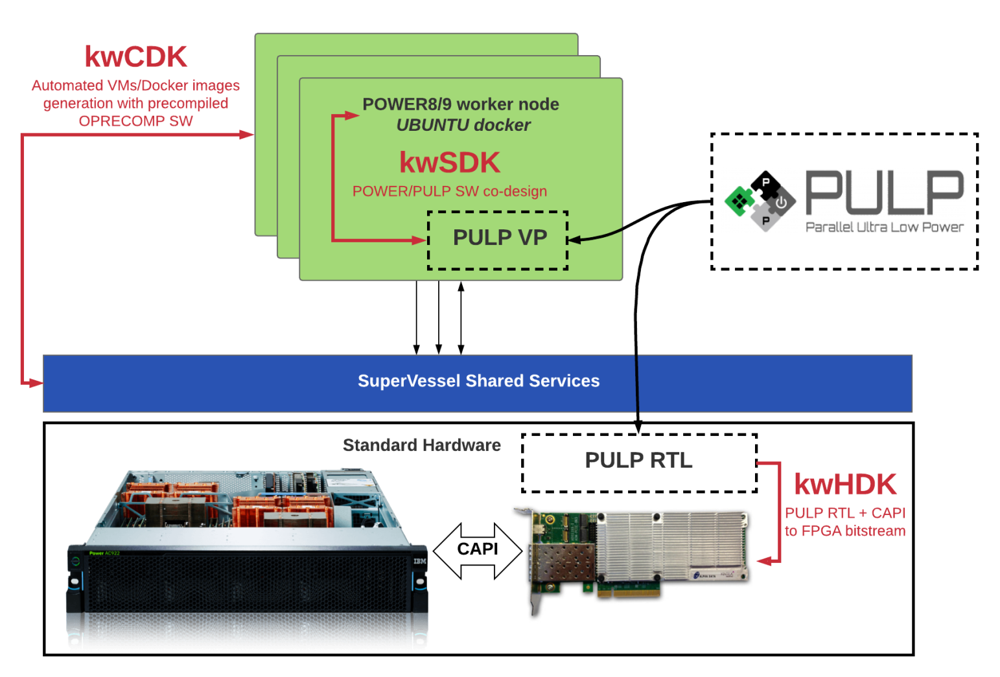

..  Licensed to the Apache Software Foundation (ASF) under one
    or more contributor license agreements.  See the NOTICE file
    distributed with this work for additional information
    regarding copyright ownership.  The ASF licenses this file
    to you under the Apache License, Version 2.0 (the
    "License"); you may not use this file except in compliance
    with the License.  You may obtain a copy of the License at

..    http://www.apache.org/licenses/LICENSE-2.0

..  Unless required by applicable law or agreed to in writing,
    software distributed under the License is distributed on an
    "AS IS" BASIS, WITHOUT WARRANTIES OR CONDITIONS OF ANY
    KIND, either express or implied.  See the License for the
    specific language governing permissions and limitations
    under the License.

.. _overview:

Overview
########

This page describes the preliminary version of the developed system architecture for the OPRECOMP kW platform.

The goal is to develop one computation node of an HPC system, based on a high-performance processing node (IBM POWER 8/9) and an array of interconnected controllable precision processors.
The OPRECOMP kW demonstrator platform provides an evaluation framework to investigate scalability and functionality of the software stack. This platform is one node of an HPC system with transprecision capabilities.

The kwPilot demonstrator is developed in two stages. In the first phase, the system is based on existing POWER8 - CAPI (Coherent Accelerator Processor Interface) attached FPGA prototyping system developed by IBM. The POWER8 processor is used for precise calculations, and an interconnected array of PULP based processing units with controllable precision is implemented on the FPGA.

In the second phase, we will upgrade the node to a POWER9 with CAPI 2.0 connection to an advanced version of PULP on a large-scale FPGA. This system will be used to validate the approach.

The actual power and performance numbers will be extracted through measurements on a dedicated ASIC that will be manufactured containing an array of the PULP based transprecision computation cores. Finally, the results on the kW system will be evaluated and they will be further projected up to a potential multi-node MW architecture.

The first version of our kw demonstrator, namely, the Pilot-kw platform, has been developed within the first phase specifications, i.e. POWER8 – CAPI attached FPGA prototyping platform.

Architecture
************
The development of the OPRECOMP kw-pilot is systematically developed in three pillars, namely the kw-pilot Hardware Development Kit (kwHDK), the kw-pilot Software Development Kit (kwSDK) and the kw-pilot Cloud Development Kit (kwCDK), as depicted in the following figure.

* The kw-pilot Hardware Development Kit (HDK) considers a scale-up version of PULP core, attached to a POWER8 node via CAPI.
* The kw-pilot Software Development Kit (SDK) describes the programming environment that enables the mapping of applications to this kw-pilot platform.
* The kw-pilot Cloud Development Kit (CDK) integrates the kw-pilot platform to a cloud infrastructure of IBM.

kwHDK
=====
.. todo:: kwHDK

kwSDK
=====
.. todo:: kwSDK

kwCDK
=====
.. todo:: kwCDK
