..  Licensed to the Apache Software Foundation (ASF) under one
    or more contributor license agreements.  See the NOTICE file
    distributed with this work for additional information
    regarding copyright ownership.  The ASF licenses this file
    to you under the Apache License, Version 2.0 (the
    "License"); you may not use this file except in compliance
    with the License.  You may obtain a copy of the License at

..    http://www.apache.org/licenses/LICENSE-2.0

..  Unless required by applicable law or agreed to in writing,
    software distributed under the License is distributed on an
    "AS IS" BASIS, WITHOUT WARRANTIES OR CONDITIONS OF ANY
    KIND, either express or implied.  See the License for the
    specific language governing permissions and limitations
    under the License.

.. _zyc2:

kwPilot on cloud
################

.. topic:: Introduction

  A prototype of kwPilot is accessible over cloud and specifically through the Zurich Heterogeneous Compute Cloud in the "Yellow Zone" of access policy (ZYC2).

  The goal of ZYC2 is to provide an easy access to heterogeneous computing systems based on the IBM POWER architecture in the cloud. ZHC2 is available to OPRECOMP partners as a free-of-charge service. The focus of ZYC2 is FPGA and GPU accelerated computing.

  ZYC2 supports different FPGA platforms and provide pre-configured software environments for FPGA development to users. More precisely ZYC2 offers KVM based VMs on x86_64 hardware to run the Xilinx development tools. There are several CentOS-based OS images available for different releases of the Xilinx Vivado toolset.

  FPGA and GPU accelerators are all hosted in POWER8 and POWER9 compute nodes and can be used through Docker images managed by the cloud environment. Up to day, there is support for the following accelerator cards:

  * Nallatech 250S (Kintex KU060 FPGA + 1.92TB M.2 NVMe SSDs + 4GB DDR4 SDRAM)
  * Alpha Data ADM-PCIE-KU3 (Kintex KU060 FPGA + 16GB DDR3 SDRAM + 2 QSFP+ 40GbE)
  * Alpha Data ADM-PCIE-8K5 (Kintex KU115 FPGA + 16GB DDR4-2400 + 2 SFP+ 10GbE)
  * Alpha Data ADM-PCIE-9V3 (Virtex VU3P-2 FPGA + 32GB DDR4-2400 + 2x QSFP28, 1x100GbE or 4x25GbE)
  * NVIDIA Tesla P100 (NVLINK connected Tesla P100 GPU w/ HBM1)

  The cloud is operated in the so-called yellow zone, an IBM-controlled management zone that is dedicated to servicing customers. Each user gets a private virtual network environment created in which client-generated KVM or Docker instances are operated in an isolated manner. Each instance gets an external IP (also called floating-IP) assigned, which can be used to access the instance from a remote computer. Public IPs, are accessed through a VPN service.

.. topic:: kwPilot flavors

  The kwPilot system allows users to conduct research on TP computing, by employing PULP, i.e. the first silicon-proven processor extended with TP extensions.
  kwPilot offers two options to develop and evaluate TP software:
    1. kwPilot emulator: a software based system that implements the functionality of the target PULP System-on-Chip, named PULP VP. The VP combines the high-speed PULP processor simulator and high-level, fully functional models of the hardware building blocks, to provide an abstract, executable representation of the hardware to software developers and to system architects. In addition, it provides full visibility, since at any time, the user can get information regarding any part of the system (processor core, buses, peripherals, or environment models). Being able to reproduce intermittent problems or complex timing-related problems on physical hardware is difficult. Instead, PULP VP provides determinism in the form of repeatability of a test case where the user will get identical behavior over and over again.
    2. kwPilot Demonstrator: a physical device emulator, where TP software can be executed on a real PULP SoC which is overlaid on an FPGA device, delivering real execution cycles and power figures.

  Both kwPilot emulator and kwPilot Demonstrator are built on POWER-based systems, and they leverage CAPI technology, as a novel way to allow PULP cores to access coherently POWER's main memory. This significantly allows for low-latency high-throughput memory transfers between POWER CPUs and PULP transprecision co-processors and provides an easy programming framework.

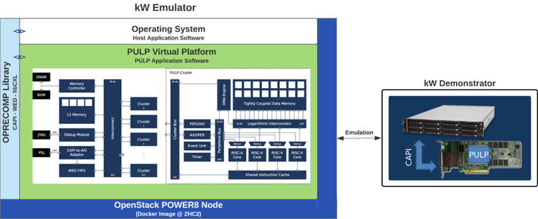

kwPilot Emulator on ZYC2
************************
Throughout the following steps we will create a Virtual Machine (VM) on ZYC2 with the support of transprecision libraries and devices.

Connecting to ZYC2
==================
In order to use the ZYC2 infrastructure you will need to connect to it via a VPN client. You should have received anOpenVPN configuration file together with your ZYC2 credentials upon registration.

.. warning:: The OpenVPN client must be version 2.4 or later

.. topic:: Linux

     On most Linux distributions you can either import the OpenVPN configuration file to the Network Manager or use the file directly with the openvpn client.

.. topic:: Windows

  On Windows you can download the OpenVPN client software (Windows Installer) from `here <https://openvpn.net/community-downloads/>`_. After installation you can launch the OpenVPN GUI and a small tray icon should appear. If you right click on it you can select "Import file..." and navigate to the ZYC2 OpenVPN configuration file. After successful import, the connection should appear in the menu. When you click connect you will be prompted a username and password. These are the credentials provided in the registration email.

Getting started with OpenStack
==============================

ZYC2 runs OpenStack to provide an Infrastructure-as-a-Service cloud. This means you can create your own virtual networks and machines.

Login
------
The main point of interaction is the OpenStack Dashboard which can be reached via http://10.12.0.100/

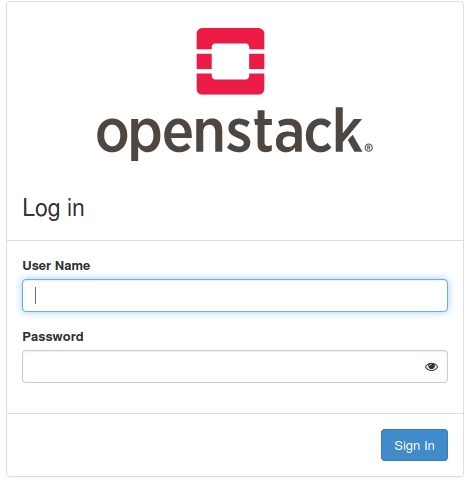

You can login using you ZYC2 credentials.

Dashboard
---------
After successful login you are presented an overview of your current project resource usage

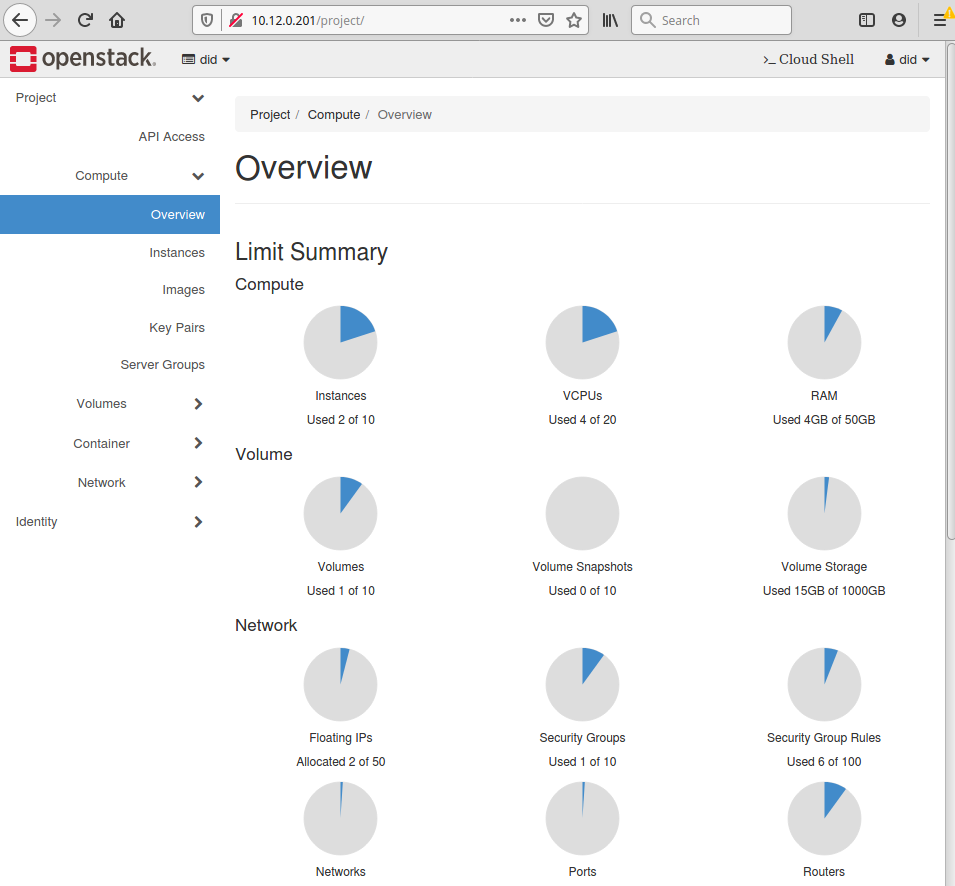

Projects
--------
On the top left of the dashboard you can see the project you currently work with. If you click on it a drop-down list will appear of all projects, you are a member of. All members of a project can see and modify the virtual infrastructure of the project. A project also has its own resource limits. You will always be a member of your own project which is named as your username.

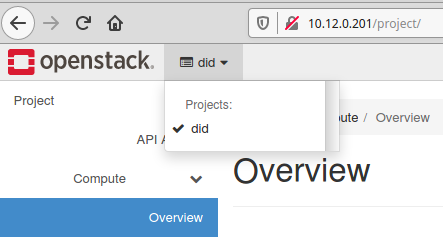

Networks
--------
An important aspect of the infrastructure is the network. In OpenStack you may create multiple private networks that belong to your project. Think of them as your “home network”. After creation of your network you may add virtual machines to it. All machines on the same network can communicate with each other.

The network configuration has already been established by ZYC2, so that your private network and the VMs connected to that can communicate with the outside world. Verify that you have a similar topology to the following.

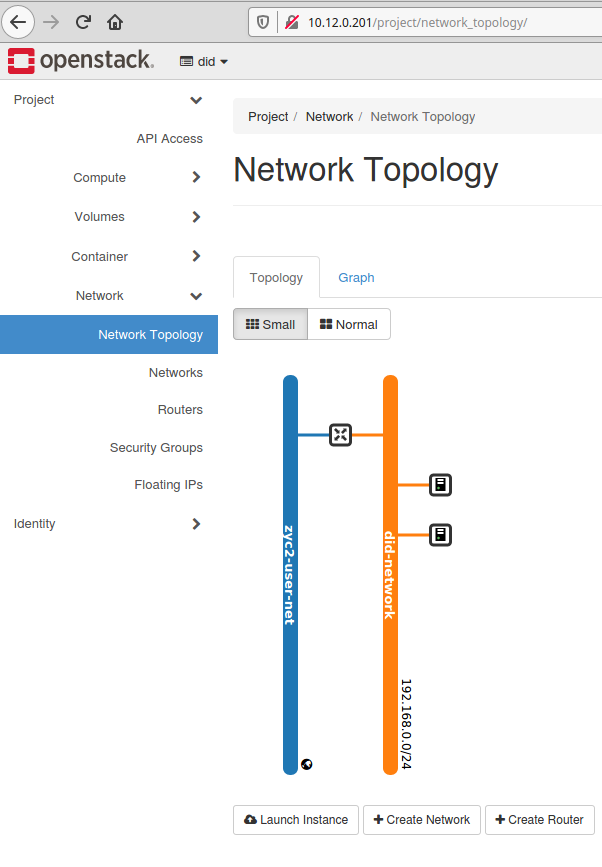
.. note:: In the previous image two VMs have already been connected to the private network (orange line) and through a virtual router they can access web (blue line). Verify that you have such configuration.

Compute
-------

Details
^^^^^^^
To create a virtual machine, navigate to Compute and then Instances. This gives you an overview of the current virtual machines in your project. You can click on Launch instance to create a new VM. When the wizard pops up, give the instance a name and click next.

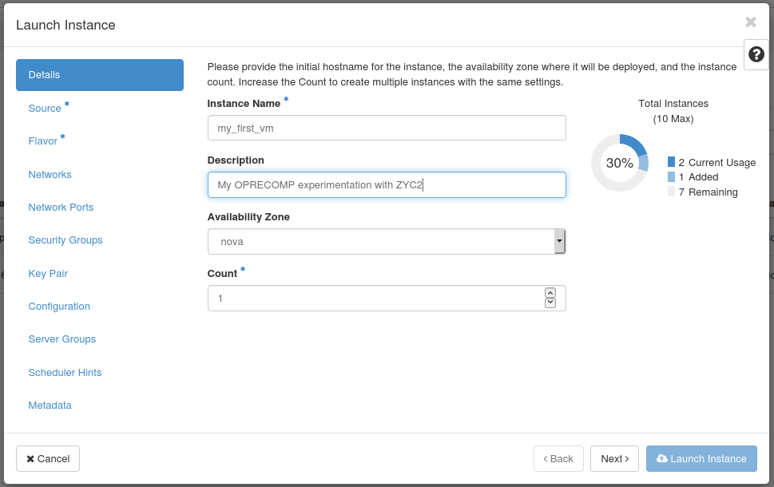

Source
^^^^^^

Next you can select the image you want the VM to run. Click on the arrow on the right to select the image you want to run.

* To select a clean Ubuntu 16.04 installation use the image "Ubuntu 16.04 POWER IBM".

* To select an Ubuntu 16.04 installation preconfigured with transprecision libraries select in the "Select Boot Source" the option "Instance Snapshot" and then from the available options use the snapshot "oprecomp_test".

.. note:: In both image options please make sure that the option "Create New Volume" is set to "No" (else the VM creation may hang).

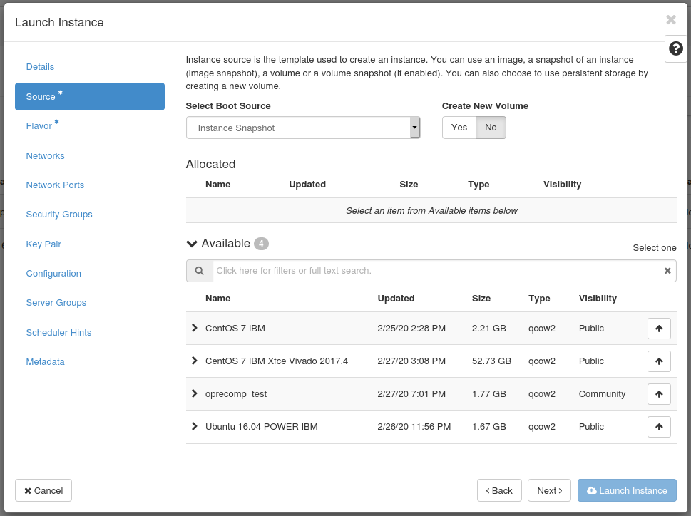

Flavor
^^^^^^

Now we can select a flavor of the virtual machine, meaning how many CPUs, memory and disk space it should have.

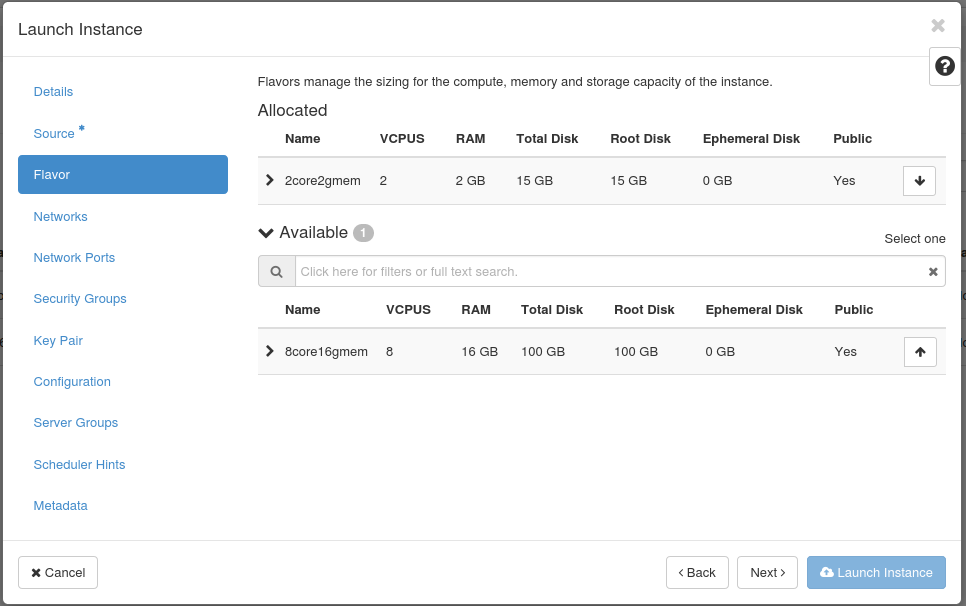

Network
^^^^^^^

Next we can select which network we want this VM to connect to. You should already have available your <username>-network.

.. image:: ../images/fig9.png

Key Pair
^^^^^^^^

All provided images use public key authentication for accessing the VMs. A public key is injected during launch of an instance. Under Key Pairyou need to add (or generate) the key you want to use.

Either import you existing public keys or create a new one through the panel.

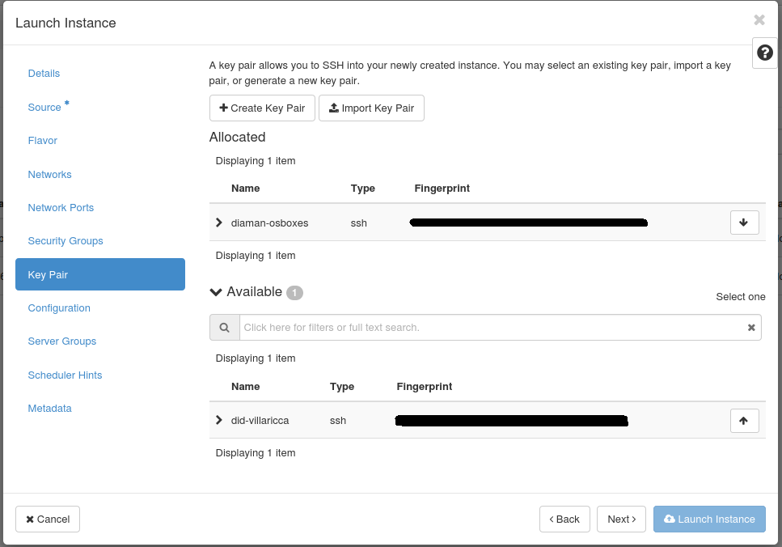

Verify new VM
^^^^^^^^^^^^^
Then you should be able to view your new VM on the dashboard. It may take some time to spawn it depending on the load of the management service and the requested resources.

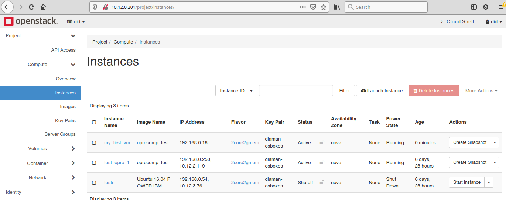

Associate floating IP
^^^^^^^^^^^^^^^^^^^^^
As a last step before you launch you new VM you should associate a public floating IP so that you can ssh to it. In the "Actions" panel select "Associate Floating IP".

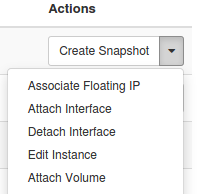

Then click the "+" symbol to add an IP and click the "Allocate IP".

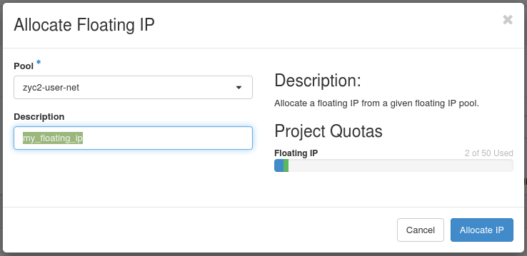

Now the floating IP will also appear in the list of your instances. This is the IP you can use to communicate with your VM.

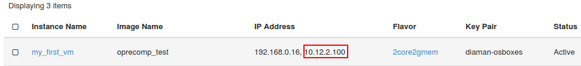

Security Groups
^^^^^^^^^^^^^^^
A last but important step is to adjust or review the security group rules associated with the VM. At VM creation you can select which security group to apply. In our case this was the default security group as it is the only one. Navigate to Network -> Security Groups and select the group to review or modify. By default, the rules are very restrictive. Click on Add Rule and add any service (tcp/udp port) that you want to access over internal or external network. ICMP and SSH rules are already added to the default security group. This allow you to ping the VMs and use ssh for communication.

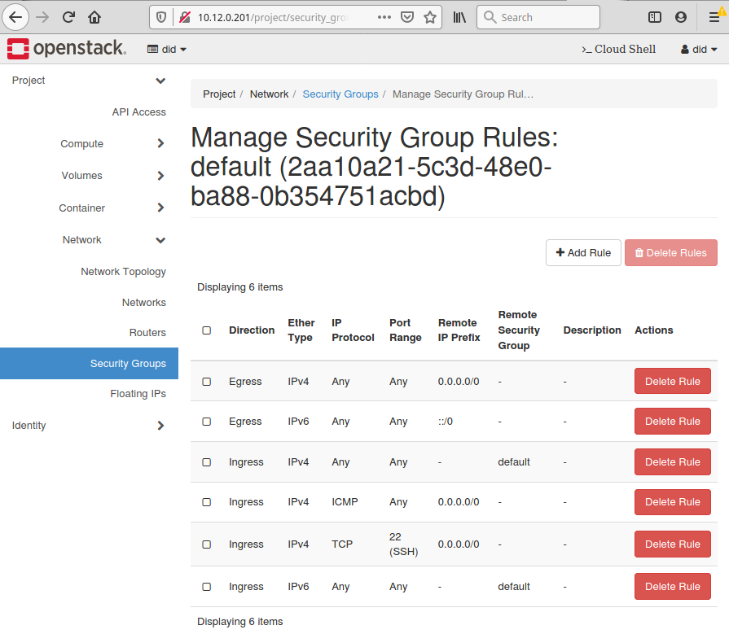

Accessing VMs
-------------
There are two ways of accessing your virtual machines:

1. One is through the Console interface of the OpenStack dashboard.

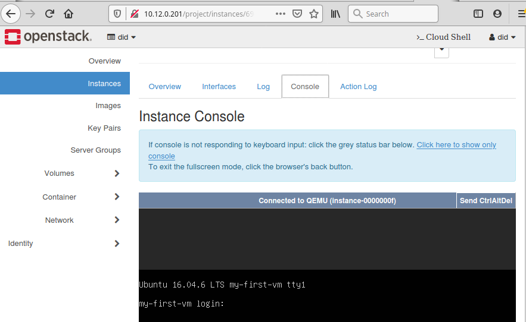

2. The other is by using SSH and potentially tunneling a VNC session over it.
You can ssh to it with the username "ubuntu", e.g.

.. code:: bash

          ssh ubuntu@10.12.2.100

To use the graphical VNC session you must enable port forwarding with a command similar as follows:

.. code:: bash

          ssh -L 5901:localhost:5901 -N -f -l ubuntu 10.12.2.100

This will forward port 5901 from/to your localhost. You can then connect to your localhost:5901 using your favorite VNC client.

Create transprecision applications
==================================

Prepare environment
-------------------

The image snapshot "oprecomp_test" is an Ubuntu 16.04 image, packed with the appropriate libraries and tools you need to create your first transprecision application.

The VM is already packed with:
 * the `riscv-gnu-toolchain for PULP <https://github.com/pulp-platform/pulp-riscv-gnu-toolchain>`_, with transprecision support (currently fp16, fp16alt, fp8). It is installed in `/opt/riscv/`.
 * the `PULP SDK <https://github.com/pulp-platform/pulp-sdk>`_, checked-out with tag 2019.12.06 and configuration ‘oprecompkw’. It is installed in `/home/ubuntu/pulp-sdk`.
 * the `libcxl for Virtual Platform <https://iis-git.ee.ethz.ch/dionysios.diamantopoulos/oprecomp/tree/master/kw/libcxl>`_ that integrates with the PULP virtual platform. Host code can call into `libcxl <https://github.com/ibm-capi/libcxl>`_ as usual, but in the background the implementation launches an instance of the virtual platform to simulate the PULP system. This library is used by kw-Pilot Emulator.
 * the `liboprecomp library <https://iis-git.ee.ethz.ch/dionysios.diamantopoulos/oprecomp/tree/master/kw/liboprecomp>`_ which is a library to offload tasks to a PULP-based accelerator reachable via `libcxl <https://github.com/ibm-capi/libcxl>`_. This library is used by kw-Pilot Demonstrator.
 * the `OPRECOMP micro-benchmarks <https://github.com/oprecomp/micro-benchmarks>`_, which contain sample transprecision micro-benchmarks. It is installed in `/home/ubuntu/micro-benchmarks`.

Test sample apps
----------------
 * nop app
    .. code:: bash

          cd /home/ubuntu/micro-benchmarks/kw/samples/nop
          make all && make run

 * square app
    .. code:: bash

           cd /home/ubuntu/micro-benchmarks/kw/samples/square
           make all && make run

 * blstm micro-benchmark
    .. code:: bash

           cd /home/ubuntu/micro-benchmarks/kw/mb/blstm
           make all && make run

